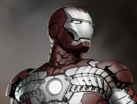
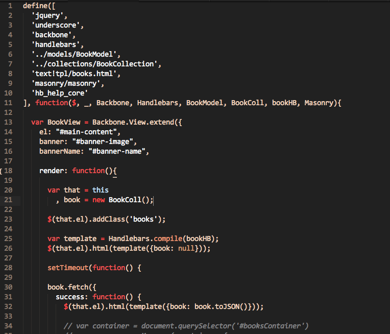
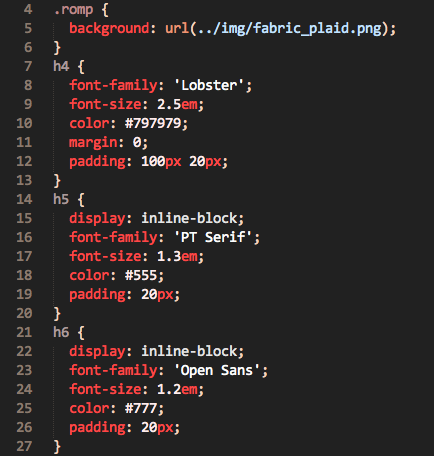
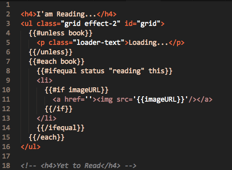
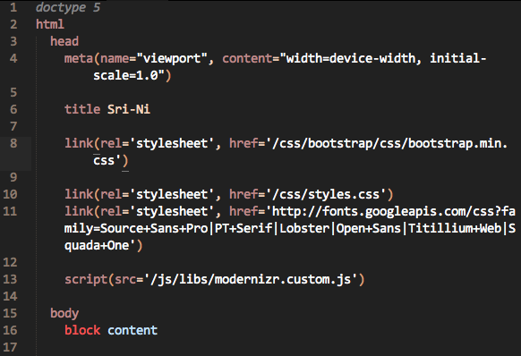
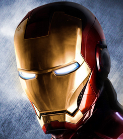

Ironman Color Scheme
==============

A color scheme for Sublime Text 2
 
&bull; inspired by <a href="https://github.com/justindmartin1">@justindmartin1's</a> <a href="https://github.com/justindmartin1/superman-color-scheme">Superman</a> color scheme for Sublime Text 2

### Update Nov 10th, 2013 - Ironman2 suitcase armor added

##### Ironman2 Suitcase Armor

**JS**

**CSS**

**HTML with handlebars**

**Jade**

##### Ironman 

**JS**

**CSS**

**HTML**

